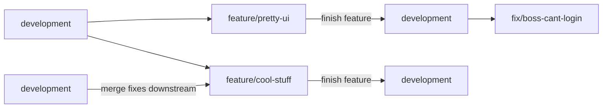

# Plan zarządzania jakością produktu

## Wytwarzanie oprogramowania

Aby zapewnić jak najwyższą jakość oprogramowania zamierzamy uwzględnić następujące narzędzia w procesie tworzenia produktu:

* CircleCi - jako narzędzie do *continous integration*
* Sentry - platforma do monitorowania błędów pochodzących ze wszystkich naszych serwisów
* Prometheus + Grafana - w celu wizualizacji i analizy danych oraz zapytań do bazy danych

## Przepływ pracy z kontrolą wersji

* Zablokowany branch główny (development). Merge możliwy jedynie poprzez **pull request**.
* Aby **pull request** został zmergowany, muszą zostać spełnione następujące warunki:
	* Akceptacja przez współpracowników poprzez Code Review.
	* Udany build na CircleCI (kompilacja, testy automatyczne i styleguide).

<!--stackedit_data:
eyJoaXN0b3J5IjpbLTEzODg2NDgwMjJdfQ==
-->